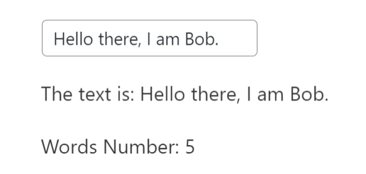

## Working in the Editor (or Backend)
> The editor is where the WordPress user creates the Page or the Post (insert, edit, delete blocks). Our team will sometimes refer to this to be the Backend (as a thing that the end user - the one who read the final page - does not see). As the name goes, the page that the user sees is named Frontend. Do not mix those terms with [this](https://en.wikipedia.org/wiki/Front_end_and_back_end).

Before diving in it. You need to use the true form of the Gutenberg interface. Create a page or reuse the previous one, and then insert a `paragraph block` with some text. When is done, enter in `Code editor` ( press on the 3 dots in the top-right corner and click the option or `Ctrl+Shift+Alt+M` ).

When you enter in this mode, you will see only text, e.g:
```html
<!-- wp:paragraph -->
<p>This is an example.</p>
<!-- /wp:paragraph -->
```
This is the true form of a WordPress page, some HTML code mixed with some labels (` wp:paragraph`) in the comments. Gutenberg is a React interface that offers the user a way to manipulate this code with buttons, inputs, sliders, etc. - **aka the Visual editor**

This is what we create, a visual interface so that the WordPress user can create some nice HTML elements for his site.

You can edit the text between the `p` tag. The change will be reflected when you go back. 

To go back, fallow the same steps and select the `Visual editor` (or `Ctrl+Shift+Alt+M`).

Now that we know [we are burdened with a glorious purpose](https://en.wikipedia.org/wiki/Glorious_Purpose), let's see what WordPress can offer us.

## Attributes

As we mentioned in the previous chapter, the `attributes` act like a database wrapped around a React hook.

Let's see how this code works:

```javascript
registerBlockType( 'themeisle-blocks/tutorial-2', {
	title: __( 'My first Block - Tutorial 2' ),
	description: __( 'Small Example 2' ),
	icon: 'universal-access-alt',
	category: 'themeisle-blocks', 
	keywords: [ 'tutorial' ],
	attributes: { 
		text: {
			type: 'string',
			default: 'Hello'
		},
	},
	edit: (props) => { 
		console.log(props)
		return (
			<div>
				<p>{props.attributes.text} World!</p>
				<button onClick={ () => props.setAttributes({ text: 'Bonjour'})}> Click to change </button>
			</div>
		)
	}, 
	save: () => null 
});
```

As you can see, we put a button for manipulating the `text` property of the `attributes`. When we click the button, the change will happen and **if we go back in the `Code editor` (`Ctrl+Shift+Alt+M`), something interesting will appear.**

You will see the following structure: `<!-- wp:themeisle-blocks/tutorial-2 {"text":"Bonjour"} /-->`

At the first glance, this look nothing like our structure from the `edit` function. Compared to the `paragraph` where we could see the `p` tag and its value. This happens because that structure belongs to the `save` function.

**The only part that belongs to the `edit` function is `wp:themeisle-blocks/tutorial-2`, which is the identification label that tells WordPress the block's name. In the first chapter, we said that you could create Netflix in the `edit` function because WordPress has no interest in the structure of the edit function. All it needs is a name. So you can change however you want, and WordPress will not complain.**

Another part that may catch your eye is `{"text":"Bonjour"}` which is a JSON object that stores our value. **This is how our mini-database works. It saves the value in JSON format directly in page as a string.**

But, we said that this acts like a database, we have some advanced usage with queries. You can see example here: https://developer.wordpress.org/block-editor/reference-guides/block-api/block-attributes/

Remember that our `paragraph` did not save our values in a JSON format, the values where only in the part created by the `save` function:

```html
<p>This is an example.</p>
```
Instead of saving the data in the object, WordPress lets you create a query that can retrieve the data from the content generated by the `save` function. Check [this](https://github.com/WordPress/gutenberg/blob/8d3db371b033d4e331702a7a837978fac79e82ca/packages/block-library/src/paragraph/block.json#L13-L19) - you can see that it selectes the `p` tag, and extracts the value which has the source as `html` (the value is a children to the `p` tag).

This is a very powerful solution when working with extensive content. Insert a large text in the `paragraph`, go to `Code editor` and observe how much space it occupies. If that value where also saved separated in JSON object when we will have duplication **which eat a big portion of storage**.

**We need to remember that most people use free WordPress vendor, and their available space is limited (1-10 GB).** Of course, some vendor offers unlimited storage, but this is pretty recent (storage becomes very cheap through the years). 

> For our blocks, this usage of queries is infrequent. We usually have short text and styling settings (color values, font size, container height).

You can see how we define the `attributes` by navigating in `src/blocks` and open the `attributes.js`.

## Edit

> The edit function is the true battlefield when developing a block. This where the magic happens. This is the pain and the sorrow. This is what we sell.

The `edit` function is just a glorified React component blessed by Gutenberg with features like `attributes` or `setAttributes`. 

The true difficulty comes when working with predefined utility components provided by WordPress: [components](https://github.com/WordPress/gutenberg/tree/trunk/packages/components) and [block-editor](https://github.com/WordPress/gutenberg/tree/trunk/packages/block-editor). 

Gutenberg documentation is not great; you can check [this](https://github.com/WordPress/gutenberg/tree/trunk/packages/block-library/src) to see how they implement some of the `core` blocks. But usually, you will search through our blocks to see the use case of the component.

This is a very simple example using some React functions.
```jsx
import { registerBlockType } from '@wordpress/block-editor';
import { __ } from '@wordpress/i18n';
import { useState, useEffect } from 'react';

registerBlockType( 'themeisle-blocks/tutorial-2', {
	title: __( 'My first Block - Tutorial 2' ),
	description: __( 'Small Example 2' ),
	icon: 'universal-access-alt',
	category: 'themeisle-blocks',
	keywords: [ 'tutorial' ],
	attributes: {
		text: {
			type: 'string',
			default: 'Hello'
		}
	},
	edit: ( props ) => {
		console.log( props );
		const [ wordsNum, setWordsNum ] = useState( 0 );
		const onTextChange = ( value ) => props.setAttributes({ text: value.target.value });

		useEffect( () => {
			setWordsNum( props.attributes?.text?.split( ' ' ).length || 0 );
		}, [ props.attributes.text ]);

		return (
			<div>
				<input value={props.attributes?.text} onChange={onTextChange} type="text" />
				<p>The text is: {props.attributes.text}</p>
				<p>Words Number: {wordsNum}</p>
			</div>
		);
	},
	save: () => null
});
```

Result: 



### [Go to Styling](styling.md)
