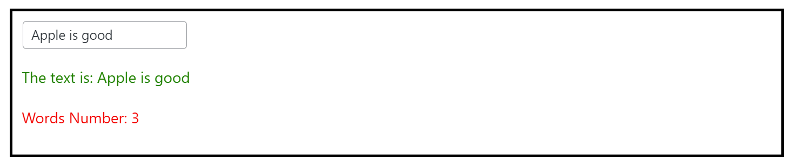
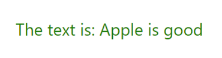
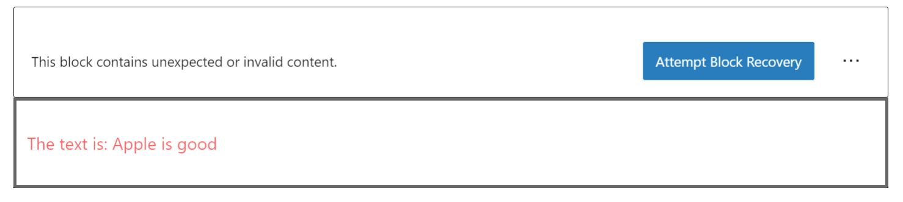
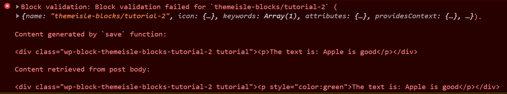

## Implementing `save` function `{{{(>_<)}}}`

This part is the most sensible; as mentioned in early chapters, WordPress takes good care of protecting users from devs `＞︿＜`.

- No hooks
- No effects
- No fun stuff

Only pure React components. For some fun stuff we need to use PHP `(ノへ￣、)`

But first, let's implement a save funciton.

### Example

```jsx
import { registerBlockType } from '@wordpress/block-editor';
import { __ } from '@wordpress/i18n';
import { useState, useEffect } from 'react';
import './editor.scss';

registerBlockType( 'themeisle-blocks/tutorial-2', {
	title: __( 'My first Block - Tutorial 2' ),
	description: __( 'Small Example 2' ),
	icon: 'universal-access-alt',
	category: 'themeisle-blocks',
	keywords: [ 'tutorial' ],
	attributes: {
		text: {
			type: 'string',
			default: 'Hello'
		},
		color: {
			type: 'string',
			default: 'green'
		}
	},
	edit: ( props ) => {
		console.log( props );
		const [ wordsNum, setWordsNum ] = useState( 0 );
		const onTextChange = ( value ) => props.setAttributes({ text: value.target.value });

		useEffect( () => {
			setWordsNum( props.attributes?.text?.split( ' ' ).length || 0 );
		}, [ props.attributes.text ]);

		return (
			<div className="tutorial">
				<input value={props.attributes?.text} onChange={onTextChange} type="text" />
				<p style={{ color: props.attributes?.color }}>The text is: {props.attributes.text}</p>
				<p>Words Number: {wordsNum}</p>
			</div>
		);
	},
	save: ( props ) => {
		return (
			<div className="tutorial">
				<p style={{ color: props.attributes?.color }}>The text is: {props.attributes.text}</p>
			</div>
		);
	}
});
```

If we save and click on preview, we have:

*Backend*



*Frontend*



*Code editor*

```html
<!-- wp:themeisle-blocks/tutorial-2 {"text":"Apple is good"} -->
<div class="wp-block-themeisle-blocks-tutorial-2 tutorial"><p style="color:green">The text is: Apple is good</p></div>
<!-- /wp:themeisle-blocks/tutorial-2 -->
```

As we can see, now we have some HTML values in the `Code editor`. And as mentioned in the [first chapter](first-block.md), `Apple is good` appears two times. Since it is very short, we do not need to worry too much.

Save the page. Go back to your IDE and delete the `style={{ color: props.attributes?.color }}` from the `save` function. (I assume you are in the dev mode with `npm run dev`)

Refresh the page and a nice surprise appears before your eyes.



The reason:



The new structure of the `save` function does not match with the old one. To avoid this error you need to write a migration scheme that you need to put it on the `deprecated` attribute on the `registerBlockType`. You can check the `src/block/slider/deprecated.js`.

:warning: *When developing the block, you could delete the block and insert a new one.*
**But for the users, this is another story; they will not want to see this error, leading them to delete their work.**

*Imagine if the bank pushes an update and loses all your information. Will you use the same bank again?* Maybe be exaggerated, but if you sell the block, they may ask for refunds. So extra attention to this part of the block development is needed. 

When we develop the block, we need to be careful when creating the HTML structure. But the CSS part can sign a pact with PHP (the Devil) to take care of it.

Yeah, you read it correctly. We will use PHP for rendering the CSS.

### [Go to Style with PHP](style-with-php.md)
