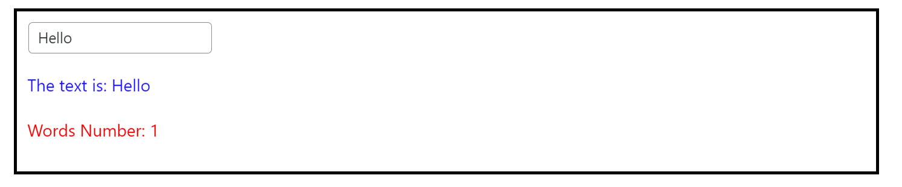
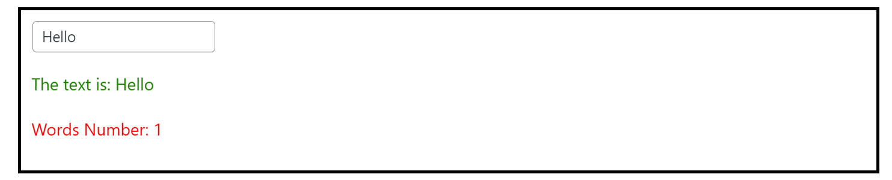

## Adding CSS/SCSS to your block

In this project, we use SCSS for styling. We have a convention for naming the files:

- style.scss = used for generating CSS in the frontend (what the final user see)
- editor.scss = used for generating CSS in the editor/backend

Usage example:

`editor.scss` is 
```scss
	.tutorial {
		border: 3px solid black;
		padding: 10px;
		p {
			color: blue;

			&:last-child {
				color: red;
			}
		}
	}
```

Block code is

```jsx
import { registerBlockType } from '@wordpress/block-editor';
import { __ } from '@wordpress/i18n';
import { useState, useEffect } from 'react';
import './editor.scss';

registerBlockType( 'themeisle-blocks/tutorial-2', {
	title: __( 'My first Block - Tutorial 2' ),
	description: __( 'Small Example 2' ),
	icon: 'universal-access-alt',
	category: 'themeisle-blocks',
	keywords: [ 'tutorial' ],
	attributes: {
		text: {
			type: 'string',
			default: 'Hello'
		}
	},
	edit: ( props ) => {
		console.log( props );
		const [ wordsNum, setWordsNum ] = useState( 0 );
		const onTextChange = ( value ) => props.setAttributes({ text: value.target.value });

		useEffect( () => {
			setWordsNum( props.attributes?.text?.split( ' ' ).length || 0 );
		}, [ props.attributes.text ]);

		return (
			<div className="tutorial">
				<input value={props.attributes?.text} onChange={onTextChange} type="text" />
				<p>The text is: {props.attributes.text}</p>
				<p>Words Number: {wordsNum}</p>
			</div>
		);
	},
	save: () => null
});
```

Result:



## What about the dynamic styling using the values from `attributes`?

For this you can use [React CSS](https://www.w3schools.com/react/react_css.asp). Most of our blocks use this.

### Example

```jsx
import { registerBlockType } from '@wordpress/block-editor';
import { __ } from '@wordpress/i18n';
import { useState, useEffect } from 'react';
import './editor.scss';

registerBlockType( 'themeisle-blocks/tutorial-2', {
	title: __( 'My first Block - Tutorial 2' ),
	description: __( 'Small Example 2' ),
	icon: 'universal-access-alt',
	category: 'themeisle-blocks',
	keywords: [ 'tutorial' ],
	attributes: {
		text: {
			type: 'string',
			default: 'Hello'
		},
		color: {
			type: 'string',
			default: 'green'
		}
	},
	edit: ( props ) => {
		console.log( props );
		const [ wordsNum, setWordsNum ] = useState( 0 );
		const onTextChange = ( value ) => props.setAttributes({ text: value.target.value });

		useEffect( () => {
			setWordsNum( props.attributes?.text?.split( ' ' ).length || 0 );
		}, [ props.attributes.text ]);

		return (
			<div className="tutorial">
				<input value={props.attributes?.text} onChange={onTextChange} type="text" />
				<p style={{ color: props.attributes?.color }}>The text is: {props.attributes.text}</p>
				<p>Words Number: {wordsNum}</p>
			</div>
		);
	},
	save: () => null
});
```

Result: 



## Another way used by cool kids! `(⌐■_■)`

Enter [Emotion](https://emotion.sh/docs/introduction).

Usage:

```jsx
/** @jsx jsx */ // <-------------- Must add this comment to enable this feature
import { registerBlockType } from '@wordpress/block-editor';
import { __ } from '@wordpress/i18n';
import { useState, useEffect } from 'react';
import './editor.scss';

registerBlockType( 'themeisle-blocks/tutorial-2', {
	title: __( 'My first Block - Tutorial 2' ),
	description: __( 'Small Example 2' ),
	icon: 'universal-access-alt',
	category: 'themeisle-blocks',
	keywords: [ 'tutorial' ],
	attributes: {
		text: {
			type: 'string',
			default: 'Hello'
		},
		color: {
			type: 'string',
			default: 'green'
		}
	},
	edit: ( props ) => {
		console.log( props );
		const [ wordsNum, setWordsNum ] = useState( 0 );
		const onTextChange = ( value ) => props.setAttributes({ text: value.target.value });

		const pStyle = css`
			color: ${ props.attributes?.color }
		`

		useEffect( () => {
			setWordsNum( props.attributes?.text?.split( ' ' ).length || 0 );
		}, [ props.attributes.text ]);

		return (
			<div className="tutorial">
				<input value={props.attributes?.text} onChange={onTextChange} type="text" />
				<p css={pStyle}>The text is: {props.attributes.text}</p>
				<p>Words Number: {wordsNum}</p>
			</div>
		);
	},
	save: () => null
});
```
You can check the `Accordion` block for this.
