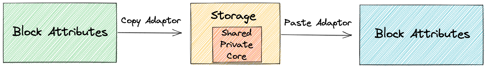

# Copy/Paste Block Style

> a friendly tool for every designer.

A simple plugin allows you to copy/paste a block's style to another. The Block can be an Otter block or a Core block.


## How it works



When you copy a block, the attributes are parsed and translated to a Common Interface named `Storage`. The inverse operation is applied when you paste.

`Storage` has three options:

- **Shared** - values that are sharable among Block: colors, dimensions, typography
- **Private** - unique values that belong to that Block can only be used to the same type. 
- **Core** - values that can be used only by Core blocks.

When adding Copy/Paste for a block, you need to implement two adaptors: one for copy and one for paste.

:warning: This feature heavily relies on Typescript for autocompletion, type compatibility, and modification. When you change the type of an attribute, Typescript will raise an error if there is a problem in the adaptor.

You can see the Common Interface declaration for `Storage` in [`src/block/plugins/models.d.ts`](../src/blocks/plugins/copy-paste/models.d.ts)

Otter adaptors in [`src/block/plugins/adaptors.ts`](../src/blocks/plugins/copy-paste/adaptors.ts)

Core adaptors in [`src/block/plugins/core-adaptors.ts`](../src/blocks/plugins/copy-paste/core-adaptors.ts)

## How to add a block

### Block attributes with Typescript support

You need to have a declaration for block attributes. Most of the blocks are implemented on `types.d.ts` in their folder. Example [Progess Bar](../src/blocks/blocks/progress-bar/types.d.ts).

Then you need to export it, like: 

```Typescript
export type ProgressAttrs = Partial<Attributes>
```

### Making the adaptors

If you do an Otter block, you will use [`Adaptors`](../src/blocks/plugins/copy-paste/adaptors.ts). For Core use [`Core Adaptors`](../src/blocks/plugins/copy-paste/core-adaptors.ts).

An adaptor is a big object where the key is the `name` of the Block from their `block.json` and it has two functions as value: `copy` and `paste`.

Example:

```Typescript
{
    'themeisle-blocks/tabs': {
        copy( attrs: TabsGroupAttrs ): Storage<TabsGroupAttrs> {
            return {
                shared: {
                    colors: {
                        text: attrs?.activeTitleColor,
                        background: attrs?.tabColor,
                        border: attrs?.borderColor
                    },
                    border: {
                        width: makeBox( addUnit( attrs?.borderWidth, 'px' ) )
                    }
                },
                private: {

                }
            };
        },
        paste( storage: Storage<TabsGroupAttrs> ): TabsGroupAttrs {
            const { shared: s } = storage;
            return {
                ...storage.private,
                activeTitleColor: s?.colors?.text,
                tabColor: s?.colors?.background,
                borderColor: s?.colors?.border,
                borderWidth: getInt( getSingleValueFromBox( s?.border?.width ) )
            };
        }
    },
}
```

You can see a symmetry between `copy` and `paste` type declarations. `copy` must take the attributes of the Block and return a `Storage`, and `paste` must take the `Storage` and return the block attributes.

Also, you can see the presence of helper functions like `addUnit` and `makeBox`. Those help us with the translation. Some blocks use only `numbers` for dimensions, while others use `string` composed of numbers and their units (px, rm, rem). 

You can write your helper function but consult with the team not to have five versions of a function that does the same.

:information_source: For Core blocks, we don't have the Typescript definition for their attributes, so we rely on the source file from their Github repo.

We will use `any` and `unknown` for the type definition.

Example

```Typescript
{
'core/group': {

        /**
         *  https://github.com/WordPress/gutenberg/blob/trunk/packages/block-library/src/group/block.json
        */
        copy( attrs: any ): Storage<unknown> {
            return merge( commonExtractor( attrs ),
                {
                    shared: {
                        layout: attrs?.layout
                    }
                }
            );
        },
        paste( storage: Storage<unknown> ): any {
            return merge( commonApplyer( storage ),
                {
                    width: storage.shared?.width?.desktop,
                    layout: storage.shared?.layout
                }
            );
        }
    },
}
```

Adding the link for the source code will be like a gift to the poor soul that it will need to fix it when WP makes some changes.

