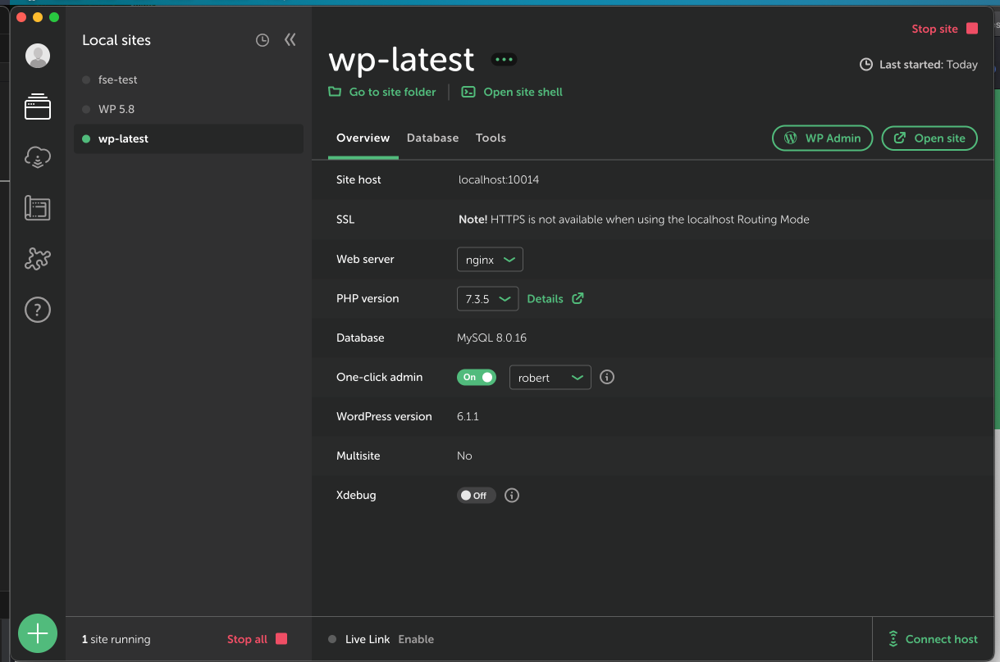

# Environment for Development

You need a WordPress environment to work on this project.

Tools what you need to have: 
- MySQL
- WordPress
- CLI tools: `wp-cli`, `composer`, `node`, `php`
- XDebug (optional) for debugging with Visual Studio Code or PHPStorm the PHP code.

## Options

### Local by Flywheel (The Best)

This is an app that spin VM instances of WordPress with various tools for development. All of them in a friendly interface.



Battery included development environment:
 - Cross-Platform: Windows, MacOS, Linux
 - Easily crate WordPress instances.
 - Easily switch between PHP versions.
 - XDebug included with Add-On for Visual Studio Code and PHPStorm.
 - Database management
 - MailHog included
 - Option to open a terminal instance with all tools included: `wp-cli, composer, php, mysql` 

Resources: 
 - Website: https://localwp.com
 - Installation guide: https://localwp.com/help-docs/getting-started/installing-local/
 - Docs: https://localwp.com/help-docs/

Mentions:
 - Working with composer should be done by using the terminal instance included in the app. Click on `Open Site Shell` in the app.
 - Use PHP 7.3.X. This is required for composer commands (`composer run lint`, `composer run format`) to work.
 - NodeJS is not included. You need to install it separately.
 - This is a WordPress only environment.
 - Making Visual Studio Code and PHPStorm to detect the PHP install file is tricky. In the terminal instance of the app, run `which php` and to see where is the PHP install file. Then in the IDE, set the PHP executable to that file. It looks something like this: `/Users/robert/Library/Application Support/Local/lightning-services/php-7.3.5+14/bin/darwin/bin/php`

### Docker

This is a containerized environment. You need to install Docker and Docker Compose. More about docker: https://www.docker.com/

The repo include a `docker-compose.yml` file that you can use to spin up a WordPress instance.

In the root of the project run:

```bash
docker-compose up -d
```

If you are using Docker for Windows or Docker for Mac, you see will in the interface that the containers are running.

Unlike Local by Flywheel, this is not a friendly option if you do not know how to use Docker. The power of this option is that you can heavily customize the environment.
Also this work everywhere where Docker is supported. If you some exotic setup like Arch Linux, this is the best option.

Tools included:
 - WordPress Instance & `composer, wp-cli`
 - PHP
 - MySQL
 - NodeJS

Mentions:
 - You can directly connect to container with Visual Studio Code. Making it very easy to work inside the container.
 - PHPStorm have the same options but requires some setup.

Resources: 
    - Docker: https://www.docker.com/
    - Docker Compose: https://docs.docker.com/compose/
    - Docker Compose file reference: https://docs.docker.com/compose/compose-file/
    - Docker Compose for WordPress: https://docs.docker.com/compose/wordpress/

### Valet (MacOS only)

One lightweight option is to use Valet. This is a tool that you install on your Mac and it will create a local domain for you. You can use this domain to access your WordPress instance. This require some manual setup. You need to download WordPress and install it manually. Install a database manually. Install PHP, Composer, NodeJS, etc. manually.

The main benefit of this option is that it is not a VM. The resource consumption is minimal. Like Docker, this is not a friendly option if you do not know how to use it. But is heavily customizable.

Resources:
 - Website: https://laravel.com/docs/5.8/valet
 - Installation guide: https://laravel.com/docs/5.8/valet#installation

Tools included:
 - None

Mentions:
 - Since everything is installed on your computer, you can use any tool without constraints (any text editor, you can write bash script for automation). 

### MAMP

App that can spin WordPress instances and other types of projects. 

Tools included:
 - WordPress
 - PHP
 - MySQL

 Resources: 
    - Website: https://www.mamp.info/en/
    - Installation guide: https://documentation.mamp.info/en/MAMP-Mac/Getting-Started/

### Cloud

One viable option is to have a cloud WP instance in which you can work. You can connect to the instance with SSH and work with it (Visual Studio Code & PHPStorm have the tools for this). This is a costly options and not to versatile.

The big benefit of this option is that you can work on the same instance with multiple people. Usually is not case, but good to know as an option.

Mentions:
- If you travel a lot and need to be more conservative with the battery, you can spin up a cloud instance and to do the heavy work there.

### Pay attention to resource consumption

Tools like Local by Flywheel, Docker, PHPStorm are heavy on the resources. If you have a low end computer, you need to be careful with the tools you use. If you have a powerful computer, you can use any of the tools. Sometime is better to make a mix of tools based on your strong desires. For example, you can use Local by Flywheel for easily management the WordPress instance and Visual Studio or lightweight text editors for coding. If you really want powerful PHP IDE, you can use PHPStorm for coding and Valet for WordPress instances. Or have a very fancy docker setup with CLI tools like `vim/neovim`, `hx` or `emacs`.

## Installing the plugin

After you have a WordPress instance, you need to install the plugin. Go to folder `wp-content/plugins` and clone the repo there with git.

Note: this need to be done in your working environment ( the terminal that has access to all the tools: terminal instanced by Local, docker connection, etc).

(if you use the docker-compose.yml file, this is step is already done for you.)

```bash
git clone https://github.com/Codeinwp/otter-blocks.git
```

After you clone the repo, you need to install the dependencies. This is done with `composer` and `npm`.

```bash
composer install --prefer-dist --no-progress --no-suggest && npm ci
```

Note: Use `npm ci` instead of `npm install` because the after also upgrade the packages (you will see `package.json` file changed ). This is not what you want.

## Running the plugin:

When developing, you need to run the plugin. This is done with `npm run start`. This will start a watcher that will watch for changes in the files and will compile the files.

```bash
npm run start
```

Note: This is not working for all JS files! If you work in `src/animation`, when you make a change you need to restart the process. If you change a SCSS file, you need to restart the process. You will mainly work in `src/blocks` and there the watcher will work. This is a limitation of the current setup.

When you add a new PHP file or work with Pull Request that add new PHP files, you need to run `composer dumpautoload -o` to make sure that the autoloader is up to date. Without this you will see errors in WordPress about not finding the PHP class.

```bash
composer dumpautoload -o
```

## Working with Git

The main workflow is around Git and Github. If you work on a issue, make sure that you create a separate branch from the `development` branch. When you are done with the issue or just to save the current work, create a Pull Request to the `development` branch.

There are a lot of tools for Git:
 - Visual Studio Code has a built in Git support. There are plugin that hugely improve the experience (maybe the best experience): [Gitlens](https://marketplace.visualstudio.com/items?itemName=eamodio.gitlens) and [Git Graph](https://marketplace.visualstudio.com/items?itemName=mhutchie.git-graph).
 - PHPStorm has a built in Git support.
 - GitKraken is a GUI for Git.
 - GitHub Desktop is a GUI for Git. Very simple to use. Not feature rich as GitKraken.
 - Sublime Merge (free to try, but it is a paid product) is a GUI for Git. Has a very good support for shortcuts (you can do almost do anything without touching the keyboard). Very fast and lightweight.

Resources: 
 - Git: https://git-scm.com/
 - Git Book: https://git-scm.com/book/en/v2
 - Git Flow: https://nvie.com/posts/a-successful-git-branching-model/

## Day to day struggle

Tools like: `composer, node, git` and Text Editor (or IDE) are a must to work with Otter. There are some feature that make your life easier:

- Code Completion: Any IDE or Text Editor that can hook to Typescript LSP can have good completion for Typescript/Javascript. For PHP, dedicated IDE or plugin is needed.
- Debugging: PHPStorm and Visual Studio Code have a very good support for debugging out of box or with plugins. **When most needed, this feature has its weight measured in gold.**
- Search: The ability to easily navigate trough the code base. You can even use GitHub for this. Their support is pretty good but not so advanced as PHPStorm or Visual Studio Code.
- Refactoring: The ability to easily refactor the code. Any IDE or Text Editor can do this. For PHP, the most advanced is PHPStorm; Visual Studio Code can do it but require a paid plugin.
- Utility: `watson` for time tracking, `gh` for working with GitHub from terminal, `tldr` for quick help, `bat` for better `cat`, `exa` for better `ls`, `fd` for better `find`, `ripgrep` for better `grep`, `fzf` for fuzzy search, `httpie` for better `curl`.
- Smart documentation: ChatGPT, [phind](https://www.phind.com)
- AI Tools: ChatGPT, Copilot, [phind](https://www.phind.com)
- Global/Multi-Repo Code Search: Github, [Sourcegraph](https://sourcegraph.com/search)


