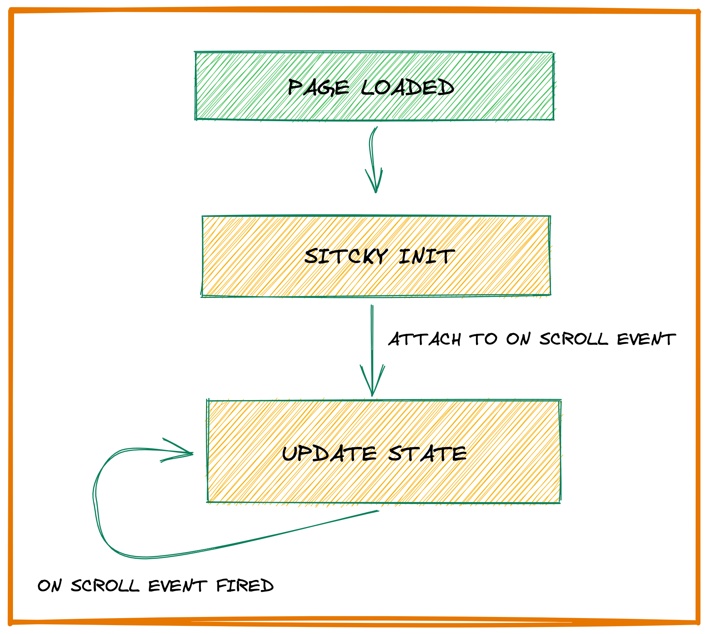

# Sticky Blocks

## Introduction

Make any Guteberg block a sticky block.

Features:
 - Sticky To: set the movement contraints based on a container.
 - Position: top & bottom. Stick to the top/bottom of the page.
 - Offset: distance between the sticky block and the screen.
 - Behaviour: what to do when multiple sticky blocks overlap
   - Collapse: they go behind each others. When the active sticky approach the next one, it starts going behind it.
   - Fade: add the fade animation. When the active sticky approach the next one, it starts going transparent. 
   - Stack: stack on on top of the other. The sticky that is going to be active will trigger when the active one is aprroaching and place itself at the bottom of it. The previous sticky needs also to be set as Stack. 
 - Enable on mobile: allow it to run on mobile devices. It is disabled by default since it may cause some problems if the sticky was not configured correctly by the user.
 - Float mode: position the sticky anywhere in the page. It can be only one in the page. The blocks who have this mode are hidden until activation.
   - Width: set the width of the block. 
   - Side to Stick: left & right. Sticky to the left/right of the page.
   - Side Offset: the space between the block and the left/right side.
   - Prevent Header Obstruction: Add some extra space between top of the page and Header via `margin-top` on `body`
  
## Workflow

### Chossing the container.

The container is an HTML element that will constrain the sticky block movement. They can be the HTML elements with the following CSS classes:
- wp-block-themeisle-blocks-advanced-column
- wp-block-themeisle-blocks-advanced-columns
- wp-block-group
- wp-block-column
- wp-block-columns

If there is no container, the `document.body` (which is referred as Screen in UI) will be used.

## Checking if the sticky is active

We check if sticky is active by comparing the registered distance (this is done at the initialization phase) from top of the page to the initial sticky element position to the current distance of the scroll.

If the scroll distance is higher, we activate the sticky element. **In Float mode, the sticky is always active**.

`getCurrentPositions` is responsible for checking if the sticky is active and where to go.

https://github.com/Codeinwp/otter-blocks/blob/e78ca5af085ad298fefaed26ce308f324f0300e1/src/blocks/frontend/sticky/index.ts#L506-L539

All the active sticky get the status of `active`.

For fancy behaviour like Fade and Stack, we need to know beforehand when other sticky block are going to be active.

This will be reffered `early activation` and the sticky elements that are goind to be active soon will the status of `dormant`.

`Early activation`, in the practival way, will be an extra distance which is the sum of the `height` property from each active block.

https://github.com/Codeinwp/otter-blocks/blob/e78ca5af085ad298fefaed26ce308f324f0300e1/src/blocks/frontend/sticky/index.ts#L570-L582

## Placeholder

When a sticky block become active, a placeholder will placed at the original sticky position for keeping the layout from breaking.

Float blocks to not have the placeholder since their original position is out of the page flow.

## Alignment 

The `align` function is the one that set the CSS values for the block to be sticky. 

https://github.com/Codeinwp/otter-blocks/blob/e78ca5af085ad298fefaed26ce308f324f0300e1/src/blocks/frontend/sticky/index.ts#L424-L444

The position is set using the `top`, `bottom`, `transform` properties. Using `translate` allow us to do some smoth transitions.

This is the heaviest math part and with a lot of possible edge cases (especially for the float mode when we want to extend to the entier screen size).